# AWS DevSecOps Pipeline
For the final project in Cloud Security, I have built a DevSecOps CI pipeline in AWS. Deployment (CD) functionality has been omitted since the source code intentionally contains vulnerabilities and deploying obviously vulnerable code is too much risk for me!

## Initial Setup in AWS
### 1. Create repository in CodeCommit
From the CodeCommit console, the repo del9498-devsecops is created. This will be the source code repository for this project.

### 2. Create CodeCommit user
Using CodeCommit requires an IAM user to handle committing to the repository. User 'devsecops' is created with the accompanying permissions, AWSCodeCommitFullAccess and AWSCodeCommitPowerUser.

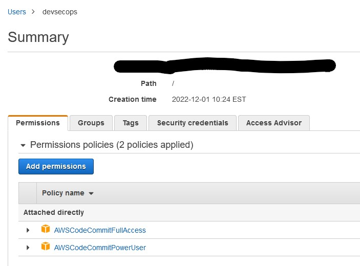

### 3. Connect local Git environment to CodeCommit

Using the [Setup steps for SSH connections to AWS CodeCommit repositories on Windows](https://docs.aws.amazon.com/codecommit/latest/userguide/setting-up-ssh-windows.html), the devsecops user is now able to commit changes to CodeCommit. 

## CodeBuild Setup
### 1. Create CodeBuild project
A new build project is created from the CodeBuild console called del9498-devsecops. It is incredibly easy to point the new CodeBuild project to the CodeCommit repository's main branch. Other configurations are kept as default or 'latest'. Additionally, the project creation process prompts you to create a new service user to handle pipeline operations and codebuild-del9498-devsecops-service-role is created.

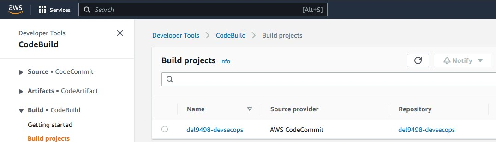

## SAST 1: SonarCloud integration

### 1. Create a buildspec.yaml
The buildspec.yaml orchestrates builds in CodeBuild projects. Any tool that is to be integrated into this DevSecOps pipeline will need to be configured in the buildspec.yaml.

The following line is added to the `commands` block of the buildspec.yaml:

`- mvn verify sonar:sonar -Dsonar.projectKey= -Dsonar.organization= -Dsonar.host.url=https://sonarcloud.io -Dsonar.login=`

### 2. SonarCloud account setup
Using my GitHub account, I can automatically create a new SonarCloud account. Then an organization and project are created, both using the name del9498. 
Finally, a token is created from the newly created SonarCloud account. The token value is copied for use later.

### 3. Move token to Secrets Manager
We want to store the token from the previous step in Secrets Manager rather than keeping any hardcoded credentials in the buildspec.yaml.
In the Secrets Manager console, Store a New Secret and store the Sonar token.

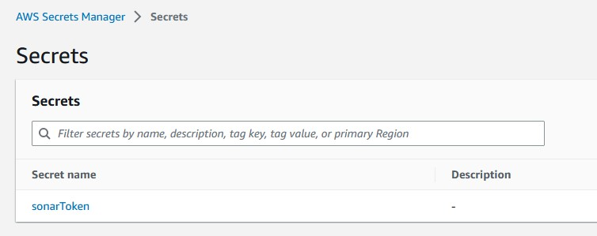

### 4. Configure buildspec.yaml to use Secrets Manager
Adding the below code block to the buildspec enables CodeBuild to use secrets stored in the Secrets Manager:
```
env:
  secrets-manager:
    SONARTOKEN: sonarToken:sonar-token
```

The Sonar configuration is also updated to use the new Sonar token:

`mvn verify sonar:sonar -Dsonar.projectKey=del9498 -Dsonar.organization=del9498 -Dsonar.host.url=https://sonarcloud.io -Dsonar.login=$SONARTOKEN `

### 5. Adding Permissions for Secrets Manager Access
After moving the SonarCloud token to AWS Secrets Manager, the build now fails:


This is because the role created in step 2 does not have permissions to read from the Secrets Manager. Back in IAM, the appropriate permission is added to codebuild-del9498-devsecops-service-role:


The build is now successfully using the token stored in Secrets Manager


## Creating a Quality Gate in SonarCloud

Since the default Sonar Way quality gate only scans new lines of code, a new quality gate called DevSecOps is created to scan all lines of code and pass if code coverage is at least 75%

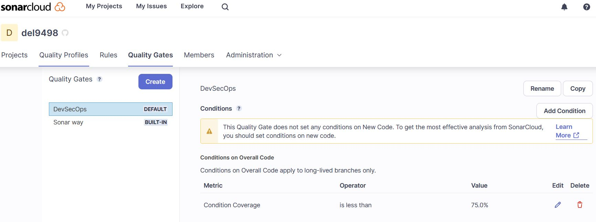

A fresh build with the new permissions and quality gate now show a successful build, but a failing Sonar scan due to insufficient code coverage.

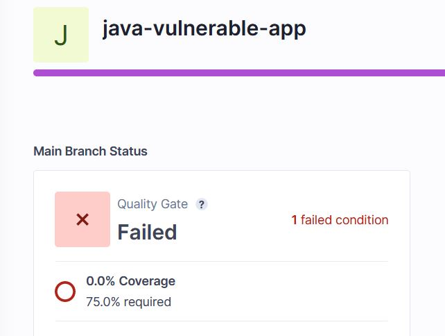

## CodePipeline Setup
So far, builds have required a manual trigger from the AWS CodeBuild dashboard. Automating the build process with AWS CodePipeline will eliminate this manual step. When a new commit is pushed to CodeCommit, CloudWatch which will trigger a new build in CodePipeline. The pipeline is configured to build the del9498-devsecops project in CodeCommit and when pipeline creation is complete, it automatically kicks off a fresh build.

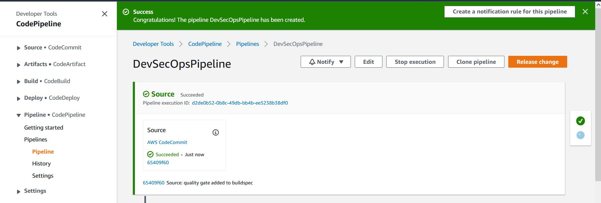

## SAST 2: Snyk
Snyk is an open source vulnerability scanner that identifies issues within source code, dependencies, configurations and more. 

### 1. Integrating Snyk in CodeBuild
Integrating Snyk is easy via the CodePipeline console by editing the existing DevSecOpsPipeline, adding a new step and following the prompts to point Snyk and AWS to each other. Once setup is complete, a fresh pipeline build will produce a report in Snyk showing 19 vulnerabilities found in the project code (including 2 criticals!).

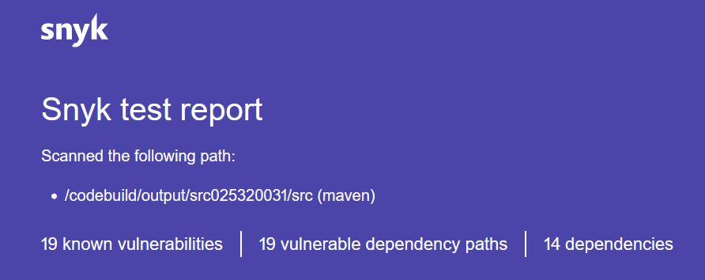

### 2. Storing build artifacts
The build process can produce a variety of artifacts: jars, wars, other executable types, and in the case of this DevSecOps pipeline, SAST scan results. As preparation for next steps, the del9498-devsecops build is configured to store build artifacts in an S3 bucket:
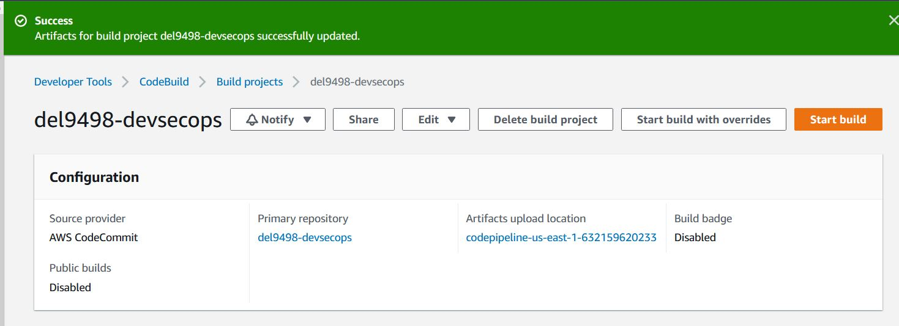

## DAST: OWASP ZAP
OWASP ZAP is a web application security scanner that can be run on live URLs. Since this very intentionally vulnerable code will not be deployed to an endpoint, https://endpoint.com will be used as an example of OWASP ZAP's capabilities. In this exercise, the build will be configured to run OWASP ZAP on https://endpoint.com and then save the results to the S3 bucket configured in the previous step.

First, the buildspec.yml needs to be updated with the commands to run OWASP ZAP. The below downloads OWASP ZAP zip file, unzips, then runs a scan on https://endpoint.com. The results of this scan are then stored in the artifacts S3 bucket for viewing later.

OWASP ZAP attack is successful:

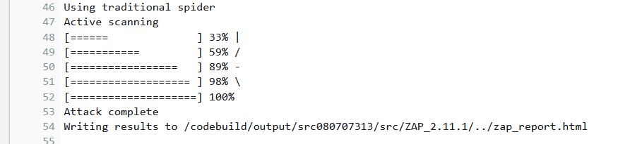

The scan report is found in codepipeline-us-east-1-632159620233 in html format:

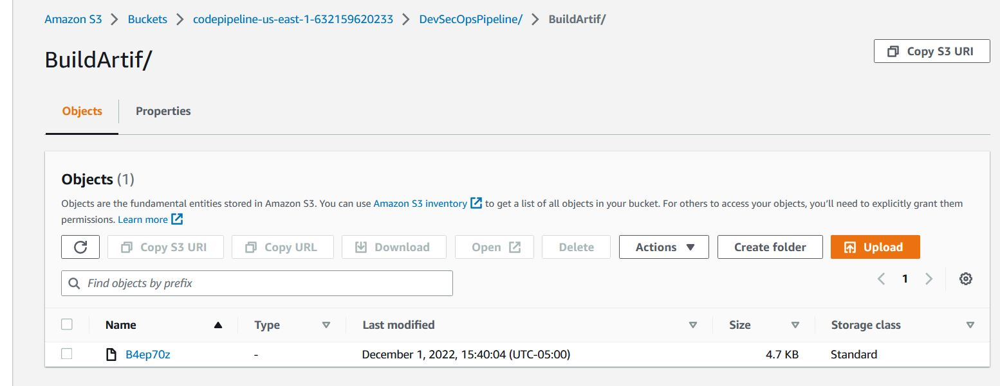

Downloading and opening the OWASP ZAP report shows detailed findings:

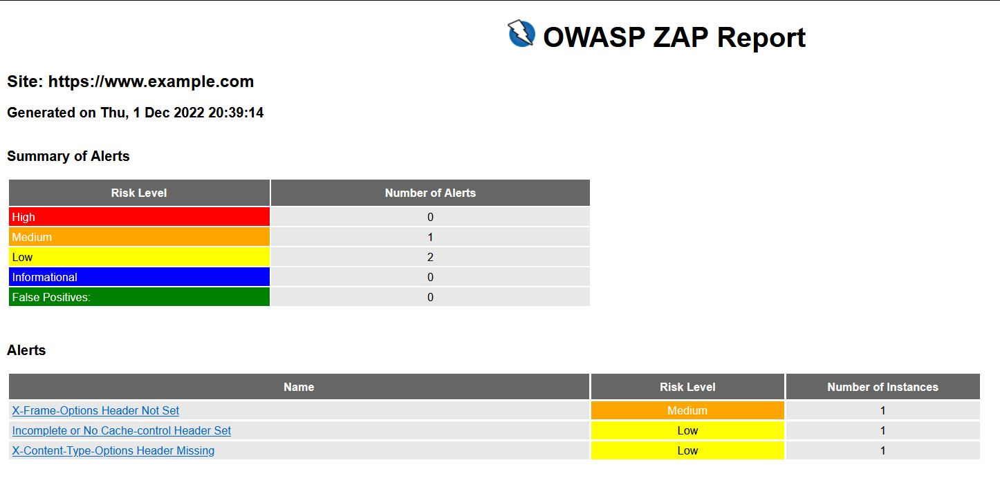

## AWS Security Services

Let's now add some other AWS Security Services to the developemnt pipeline.

### 1. Security Hub

According to the Security Hub start page, "AWS Security Hub provides a consolidated view of your security status in AWS. Automate security checks, manage security findings, and identify the highest priority security issues across your AWS environment". The service helps you set security standards across your AWS infrastructure.

The prerequisite for using Security Hub is AWS Config Console in order to record in all resources and accounts where Security Hub will be implemented. 
A Config Console is started using default values and enabling ALL rules.


### 1. Guard Duty

Guard Duty will read logs and detect unusual behavior.

Guard Duty has detected the use of root credentials during the initial setup of this DevSecOps pipeline:


When Guard Duty detects a new finding, I wish to automate notifications to my security engineer at del9498@nyu.edu so they may investigate and remediate any findings.

This notification process requires us to setup an SNS topic and endpoint.
1. A new SNS topic is created called GuardDutyEmailNotification
2. Next, a new subscription is created which will email del9498@nyu.edu.
3. The subscription is confirmed from del9498@nyu.edu account.


Next, EventBridge must be setup for GuardDuty findings.
1. Create a new rule 
2. Update the Event Pattern to send a notification for findings with a severity from 1 - 10

`
{
  "source": ["aws.guardduty"],
  "detail-type": ["GuardDuty Finding"],
  "detail": {
    "severity": [1, 1.0, 1.1, 1.2, 1.3, 1.4, 1.5, 1.6, 1.7, 1.8, 1.9, 2, 2.0, 2.1, 2.2, 2.3, 2.4, 2.5, 2.6, 2.7, 2.8, 2.9, 3, 3.0, 3.1, 3.2, 3.3, 3.4, 3.5, 3.6, 3.7, 3.8, 3.9, 4, 4.0, 4.1, 4.2, 4.3, 4.4, 4.5, 4.6, 4.7, 4.8, 4.9, 5, 5.0, 5.1, 5.2, 5.3, 5.4, 5.5, 5.6, 5.7, 5.8, 5.9, 6, 6.0, 6.1, 6.2, 6.3, 6.4, 6.5, 6.6, 6.7, 6.8, 6.9, 7, 7.0, 7.1, 7.2, 7.3, 7.4, 7.5, 7.6, 7.7, 7.8, 7.9, 8, 8.0, 8.1, 8.2, 8.3, 8.4, 8.5, 8.6, 8.7, 8.8, 8.9, 9.0, 9.1, 9.2, 9.3, 9.4, 9.5, 9.6, 9.7, 9.8, 9.9, 10.0]
  }
}
`

3. Use the GuardDutyEmailNotification topic from the previous step as the rule's target


