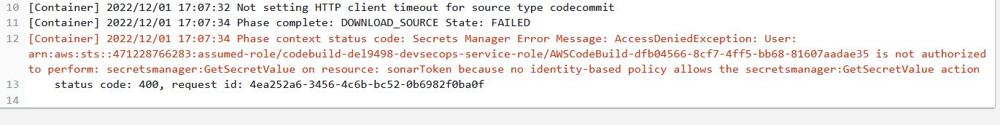
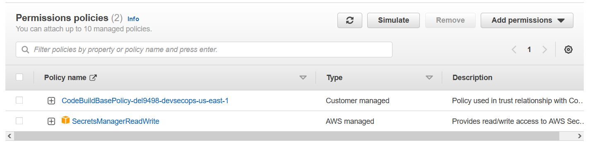

# AWS DevSecOps Pipeline
For the final project in Cloud Security, I have built a DevSecOps CI pipeline in AWS. Deployment (CD) functionality has been omitted since the source code intentionally contains vulnerabilities and deploying obviously vulnerable code is too much risk for me!
### 1. Commit vulnerable code to CodeCommit
### 2. Set up CodeBuild to build project
codebuild-del9498-devsecops-service-role
### 3. Integrate CodeBuild with Sonar Cloud for code quality scanning
### 4. Move token to Secrets Manager
### 5. Update build user permissions to enable Secrets Manager Access
After moving the SonarCloud token to AWS Secrets Manager, the build now fails:

This is because the role created in step 2 does not have permissions to read from the Secrets Manager. Back in IAM, the appropriate permission is added to codebuild-del9498-devsecops-service-role:

