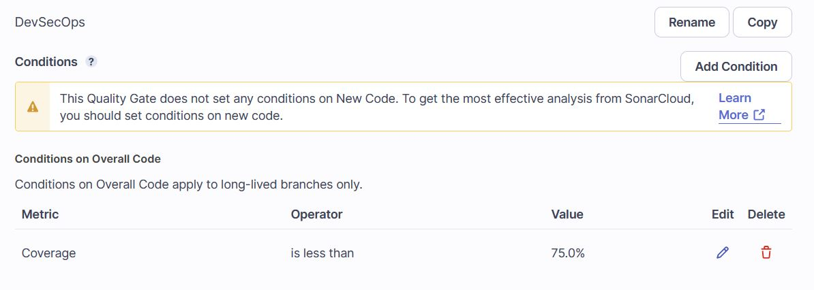

# AWS DevSecOps Pipeline
For the final project in Cloud Security, I have built a DevSecOps CI pipeline in AWS. Deployment (CD) functionality has been omitted since the source code intentionally contains vulnerabilities and deploying obviously vulnerable code is too much risk for me!

## Initial DevSecOps Pipeline creation in AWS
### 1. Commit vulnerable code to CodeCommit
### 2. Set up CodeBuild to build project
codebuild-del9498-devsecops-service-role
### 3. Integrate CodeBuild with Sonar Cloud for code quality scanning
### 4. Move token to Secrets Manager
### 5. Update build user permissions to enable Secrets Manager Access
After moving the SonarCloud token to AWS Secrets Manager, the build now fails:

This is because the role created in step 2 does not have permissions to read from the Secrets Manager. Back in IAM, the appropriate permission is added to codebuild-del9498-devsecops-service-role:

Since the default Sonar Way quality gate only scans new lines of code, a new quality gate called DevSecOps is created to scan all lines of code and pass if code coverage is at least 75%

A fresh build with the new permissions and quality gate now show a successful build, but a failing Sonar scan due to insufficient code coverage.

So far, builds have required a manual trigger from the AWS CodeBuild dashboard. Automating the build process with AWS CodePipeline will eliminate this manual step. When a new commit is pushed to CodeCommit, CloudWatch which will trigger a new build in CodePipeline. The pipeline is configured to build the del9498-devsecops project in CodeCommit and when pipeline creation is complete, it automatically kicks off a fresh build.

## Itegrating other open source SaaS and SAST tooling into the DevSecOps Pipeline
### 1. Snyk
Snyk is an open source vulnerability scanner that identifies issues within source code, dependencies, configurations and more. 
Integrating Snyk is easy via the CodePipeline console by editing the existing DevSecOpsPipeline, adding a new step and following the prompts to point Snyk and AWS to each other. Once setup is complete, a fresh pipeline build will produce a report in Snyk showing 19 vulnerabilities found in the project code (including 2 criticals!).

### 2. Storing build artifacts
The build process can produce a variety of artifacts: jars, wars, other executable types, and in the case of this DevSecOps pipeline, SAST scan results. As preparation for next steps, the del9498-devsecops build is configured to store build artifacts in an S3 bucket:

### 3. OWASP ZAP
OWASP ZAP is a web application security scanner that can be run on live URLs. Since this very intentionally vulnerable code will not be deployed to an endpoint, https://endpoint.com will be used as an example of OWASP ZAP's capabilities. In this exercise, the build will be configured to run OWASP ZAP on https://endpoint.com and then save the results to the S3 bucket configured in the previous step.

First, the buildspec.yml needs to be updated with the commands to run OWASP ZAP. The below downloads OWASP ZAP zip file, unzips, then runs a scan on https://endpoint.com. The results of this scan are then stored in the artifacts S3 bucket for viewing later:

